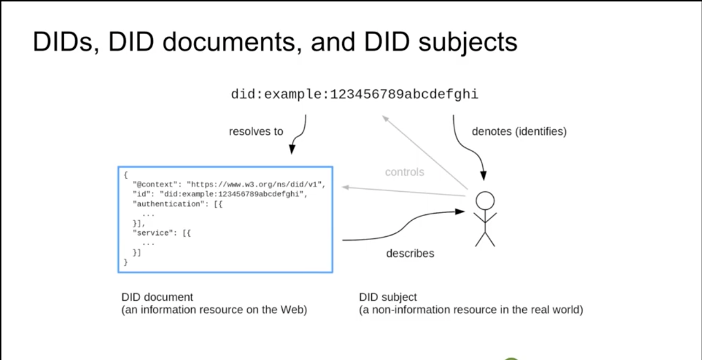

# Self-Sovereign Identity

## Verifiable Data
data that has been digitally signed using a cryptographic algorithm. Signature can be verified.

## Verifiable Credentials

### Current state of affairs
- Traditionally, in the physical world, documents like drivers licenses or passports are `issued` by government agenies. the government **asserts** your personal information and declares the **permissions** you have e.g. what type of vehicles you're allowed to operate. The **authenticity** of this document is encoded in a physical watermark on the document itself. these watermarks can be scanned to prove that the document was in fact issued by the issuer stated on the document. **This means, to trust the document you need to trust the issuer.**
- Some facilities have the ability to scan these documents. these facilties are considered as the **trust network** e.g. gas stations or liquor stores have the ability to scan drivers licenses. 
- The thought here is that: because you trust the government and the scanner that they approve, you will also trust the person whose document is verified by the scanner

### Cryptography
- The same concept described above can be achieved using cryptographic signatures. 
- the "most common" standard for verifiable data is defined by a W3C spec called `VerifiableCredential`. [Reference](https://www.w3.org/TR/vc-data-model/#what-is-a-verifiable-credential)
- attributes of `VerifiableCredential` include:
    - `issuer`
        - think driver's licenses. The issuer of texas drivers licenses is the Texas DPS
    - `subject`
        - the drivers license holder. 
    - `proof`
        - algorithms that can be used to verify the credential
    - `data`
        - arbitrary data.
- Example
```json
{
  "@context": [
    "https://www.w3.org/2018/credentials/v1"
  ],
  "type": [
    "VerifiableCredential"
  ],
  "issuer": {
    "id": "did:web:veramo.dev"
  },
  "issuanceDate": "2010-01-01T19:73:24Z",
  "credentialSubject": {
    "id": "did:example:user",
    "community": {
      "rank": "rockstar"
    }
  },
  "proof": {
    "type": "RsaSignature2018",
    "created": "2017-06-18T21:19:10Z",
    "proofPurpose": "assertionMethod",
    "verificationMethod": "https://example.edu/issuers/keys/1",
    "jws": "eyJhbGciOiJSUzI1NiIsImI2NCI6ZmFsc2UsImNyaXQiOlsiYjY0Il19..TCYt5X
    sITJX1CxPCT8yAV-TVkIEq_PbChOMqsLfRoPsnsgw5WEuts01mq-pQy7UJiN5mgRxD-WUc
    X16dUEMGlv50aqzpqh4Qktb3rk-BuQy72IFLOqV0G_zS245-kronKb78cPN25DGlcTwLtj
    PAYuNzVBAh4vGHSrQyHUdBBPM"
  }
}
```

### Decentralized Identifiers (DID)
- A `DID` is a type of unique identifier that can be created independent of any central authority. 
- `DID`s are designed to prove control over some data and also to be used as a mechanism to verify the ownership of said data by using the proof attached to the data (e.g. `proof` in the DID above)
- a `DID` is very technically a `URI`. `URL`s are `URI`s. So are `URN`s.
    - URLs locate resources on a network. 
        - We all know what these are and use them all the time. e.g. [https://square.com](https://square.com)
        - what URLs locate can change
    - URNs are presistent names for a resource that will **never** change no matter its location
    - a `DID` is functionally a `URN` that in many cases can be resolved into one or more `URL`s
- Example `DID`: `did:example:abcdefg`
    - `did:` 
        - this is static and will always be the same. It specifies the protocol being used, just like `https:` for `URL`s
    - `example:`
        - this is known as the DID method
        - a DID method defines how CRUD operations for a DID of that DID method are executed
          - so, for our example `did:example:abcdefg`, `example:` will have a definition of how to create, update, read and, delete this DID
        - **TODO**: add more here
    - `abcdefg`
        - DID Method specific string
        - **TODO**: add more here
- `DID`s are:
    - permanent and persistent
    - resolvable
        - you can look them up to discover metadata
    - cryptographically verifiable
    - decentralizable



### DID Methods
- we'll use this DID as our example for the rest of this section: `did:web:veramo.dev`
- the DID method in our example is `web:`
  - `web` DIDs can be created without a blockchain. 
  - there are DID Methods that exist that do have blockchain dependencies (e.g. `ethr:` -> `did:ethr:0xc530503a148babcaca68565cfa576d6f43427a2d`) 
- DID methods are defined by a `DID method specification`
  - this spec will define how to create, update, read and, delete this DID
- There are about 40 different DID methods that currently exist
  - veramo currently supports 3 main DID methods: `web`, `ethr`, and `key`

### DID Creation
- When a DID is created, it is typically associated with a private and public key pair. 
  - The public key will be visible in the DID Document.
  - the public/private key pair is what allows the subject (or controller) of the DID to generate proofs that are verifiable by anyone that has the corresponding DID Document for a given DID


### DID Resolution
- DID Resolvers can take a `DID` as input and resolve the DID Document. 
  - this is just like how our web browsers take a url and return a web page
    - so an analogy to web URLs here would be: [https://square.com](https://square.com) here would be the DID and square's website would be the DID document

### DID Document
- Every single `DID` has a DID Document that describes a given `DID` subject.
  - for the `web:` DID method, DID documents are hosted on the website that follows the method (e.g. `did:web:veramo.dev`). Here's an example:
  ```json
  // 20201110152830
  // https://veramo.dev/.well-known/did.json

  {
    "@context": "https://w3id.org/did/v1",
    "id": "did:web:veramo.dev",
    "publicKey": [
      {
        "id": "did:web:veramo.dev#0405aa19bb98a5fd29c15a730cb5064ca128dea19247b896b1a7bdad0b4bccccda9b47366cd1359e740d938e5a47d7bed0501150e8a1623805ac47c489421b1506",
        "type": "Secp256k1VerificationKey2018",
        "controller": "did:web:veramo.dev",
        "publicKeyHex": "0405aa19bb98a5fd29c15a730cb5064ca128dea19247b896b1a7bdad0b4bccccda9b47366cd1359e740d938e5a47d7bed0501150e8a1623805ac47c489421b1506"
      }
    ],
    "authentication": [
      {
        "type": "Secp256k1SignatureAuthentication2018",
        "publicKey": "did:web:veramo.dev#0405aa19bb98a5fd29c15a730cb5064ca128dea19247b896b1a7bdad0b4bccccda9b47366cd1359e740d938e5a47d7bed0501150e8a1623805ac47c489421b1506"
      }
    ],
    "service": [
      {
        "id": "did:web:veramo.dev#msg",
        "type": "Messaging",
        "serviceEndpoint": "https://veramo.dev/messaging",
        "description": "Handles incoming POST messages"
      }
    ]
  }
  ```
  - Here, we can see the `web` DID was issued by `veramo.dev`. the subject's DID public key is `did:web:veramo.dev#0405aa19bb98a5fd29c15a730cb5064ca128dea19247b896b1a7bdad0b4bccccda9b47366cd1359e740d938e5a47d7bed0501150e8a1623805ac47c489421b1506`


### Signing and Keys
- the following 2 videos do way better than my notes will:
  - [Computerphile - Public Key Cryptography <Youtube>](https://youtu.be/GSIDS_lvRv4)
  - [Computerphile - What are Digital Signatures? <Youtube>](https://youtu.be/GSIDS_lvRv4)