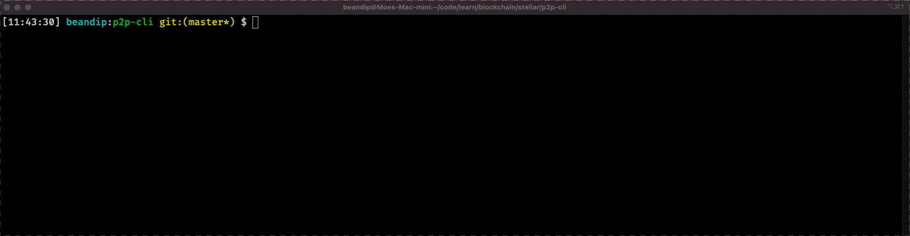

## Overview
A CLI to send assets from one account to another using the stellar network

## Usage

## Account Setup
### Mainnet
- I created 2 accounts for testing using [Stellar Labratory](https://laboratory.stellar.org/#account-creator?network=public)
- In order for an account to be cemented on the stellar blockchain, you need to fund them with at least 2XLM
  - I funded both accounts using coinbase pro
- In order to accept anchored assets (e.g. USD), you need to create a trustline between you and an anchor
  - for USD, i created a trustline with [anchorUSD](https://stellar.expert/explorer/public/account/GDUKMGUGDZQK6YHYA5Z6AY2G4XDSZPSZ3SW5UN3ARVMO6QSRDWP5YLEX)
  - for GBP, i created a trustline with [swisscustody](https://stellar.expert/explorer/public/account/GDQSKB25T24N62MHTJGB5ONRURVWEDMZBOGII7B57RZ77CU5CLMWKTR6)

### Testnet
- **TODO*: add instructions

## Notes
- This is still a WIP. there are 2 bugs that i need to iron out.